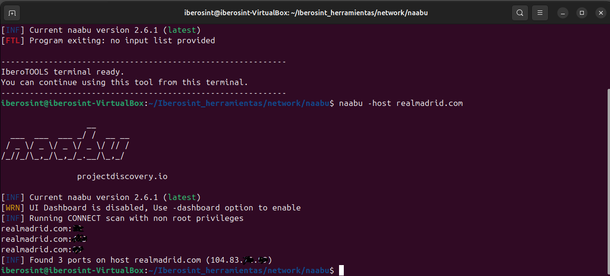

<p align="center">
  
</p>

<h1 align="center">IberOSINT</h1>

<p align="center">
<b>Unified Open Source Intelligence Platform</b><br>
A modular ecosystem for Open Source Intelligence, cybersecurity investigations and AI-assisted analysis.
</p>

<p align="center">

<a href="README.md">🇪🇸 Español</a> | <b>🇬🇧 English</b>

</p>

<p align="center">


</p>

---

# What is IberOSINT?

**IberOSINT** is a modular platform designed to centralize Open Source Intelligence (OSINT) tools, automate investigative workflows and enhance information analysis through Artificial Intelligence within a unified working environment.

The platform brings together several specialized applications under a single graphical interface, allowing analysts to access OSINT resources, investigation tools, automation features and AI-powered assistants without relying on multiple independent platforms.

Rather than being a simple collection of tools, IberOSINT provides a structured, scalable ecosystem focused on improving the efficiency of cybersecurity investigations, threat intelligence and digital research.

---

# Project Background

IberOSINT was originally developed as a **Master's Thesis** within the **Master's Degree in Cybersecurity** at the **Universidad Católica de Murcia (UCAM), Spain**.

The initial objective was to build a Linux-based distribution focused on Open Source Intelligence by integrating multiple investigation tools into a single working environment.

As development progressed, the project evolved far beyond its original academic scope into a modular ecosystem composed of custom applications specifically designed to support digital investigations, automation and AI-assisted analysis.

Today, IberOSINT continues to evolve as an independent research and development project.

---

# Design Philosophy

The development of IberOSINT is based on five fundamental principles:

- Centralize access to OSINT resources.
- Reduce time spent on repetitive investigative tasks.
- Assist analysts through workflow automation.
- Use Artificial Intelligence as analytical support, never as a replacement for human judgment.
- Maintain a modular architecture that can easily evolve over time.

---

# Why IberOSINT?

Unlike many similar projects, IberOSINT is not intended to be just another collection of cybersecurity tools.

Its goal is to provide a unified workspace where every module plays a specific role within the intelligence gathering and investigation process.

Key features include:

- Modular Python-based architecture.
- Dedicated graphical interface.
- Integrated OSINT workspace.
- Latest News Section from INCIBE and MuySeguridad.
- Specialized Firefox and Tor Browser environments.
- Artificial Intelligence integration.
- Workflow automation.
- Centralized tool management.
- Scalable architecture.
- Consistent user experience across all modules.

---

# Overall Architecture

The IberOSINT ecosystem consists of several specialized applications working together under a single Launcher.

```

                    IberOSINT
                         │
        ┌────────────────┼────────────────┐
        │                │                │
 IberoFirefox      IberoTOR       IberoTOOLS
        │                │                │
        └────────────────┼────────────────┘
                         │
                  IberOSINT AI
                         │
                       Lince
                         │
                     Tutorials

```

Each module has been designed to address a specific stage of the OSINT investigation workflow while maintaining a modular architecture that simplifies future maintenance and expansion.

---

# The IberOSINT Ecosystem

IberOSINT is composed of several specialized applications designed to support every stage of an Open Source Intelligence investigation.

Each module addresses a specific operational need while sharing a common design philosophy, a consistent user experience and seamless integration through the main Launcher.

---

# Launcher

The Launcher serves as the central entry point to the entire IberOSINT ecosystem.

Through a single graphical interface, users can access every available module, organize their workspace and launch all integrated applications without leaving the platform.

Its primary objective is to simplify the investigative workflow by providing a unified and intuitive working environment.

### Main Features

- Python-based graphical interface.
- Centralized access to all ecosystem modules.
- Modular and scalable architecture.
- Intuitive organization of tools.
- Integration with external applications.

<p align="center">

</p>

*Main launcher interface.*

---

# IberoFirefox

IberoFirefox is a dedicated OSINT workspace built around Firefox, providing fast access to more than one hundred of carefully organized intelligence resources.

Instead of searching for investigation tools across multiple websites, analysts can access a centralized homepage where resources are grouped into logical categories for quick navigation.

The homepage has been developed entirely using HTML, CSS and JavaScript.

### Main Features

- Custom OSINT homepage.
- Categorized intelligence resources.
- Integrated search engine.
- Favorites management.
- Recently used resources.
- Investigation-oriented interface.

<p align="center">

</p>

*Integrated OSINT workspace for Firefox.*

---

# IberoTOR

IberoTOR extends the same philosophy to Tor Browser, providing an investigation environment specifically designed for situations where anonymous browsing is required.

It maintains the same organizational structure and user experience as IberoFirefox while focusing on resources and workflows that benefit from the privacy offered by the Tor network.

### Main Features

- Tor Browser integration.
- Anonymous OSINT workspace.
- Centralized access to investigation resources.
- Category-based organization.
- Consistent interface across the ecosystem.

<p align="center">

</p>

*OSINT workspace designed for Tor Browser.*

---

# IberoTOOLS

IberoTOOLS provides centralized management of the tools installed within the platform, allowing investigators to launch utilities directly from the graphical interface without remembering commands or installation paths.

Its modular design makes it easy to incorporate additional applications as the ecosystem continues to grow.

### Main Features

- Centralized tool management.
- Fast access to installed applications.
- Modular architecture.
- Organized by categories.
- Seamless Launcher integration.

<p align="center">

</p>

*Unified management of integrated investigation tools.*

<p align="center">

</p>

*Example of using IberoTOOLS with the naabu tool.*

---

# IberOSINT AI

IberOSINT AI introduces Artificial Intelligence capabilities into the platform to assist analysts throughout different stages of an investigation.

Rather than replacing human expertise, AI is used to support evidence interpretation, automate repetitive tasks, summarize information and improve analytical efficiency.

The architecture has been designed to support multiple AI providers while maintaining a consistent user experience.

### Main Features

- Multi-provider AI integration.
- AI-assisted investigations.
- Workflow automation.
- Modular architecture.
- Easily extensible design.

<p align="center">

</p>

*Artificial Intelligence services integrated into the platform.*

---

# Lince

Lince is the document analysis component of the IberOSINT ecosystem.

It enables investigators to process digital evidence, perform AI-assisted document analysis, extract Indicators of Compromise (IOCs), generate structured reports and support decision-making during cybersecurity investigations.

Its development has focused on combining advanced automation with an intuitive user interface that always keeps the analyst in control.

### Main Features

- AI-assisted document analysis.
- Multi-evidence processing.
- Automatic IOC extraction.
- Structured report generation.
- IOC dashboard.
- Multiple AI provider support.

<p align="center">

</p>

*Lince document analysis platform.*

---

# Tutorials

The Tutorials module provides practical documentation intended to help users make the most of the IberOSINT ecosystem.

It includes step-by-step guides, technical references and best practices covering both the platform itself and the integrated investigation tools.

The documentation is organized progressively, making it suitable for both new users and experienced cybersecurity professionals.

### Main Features

- Step-by-step guides.
- Technical documentation.
- Best practices.
- Learning resources.
- Continuously expanding knowledge base.

<p align="center">

</p>

*Integrated learning and documentation center.*

---

# Technologies

IberOSINT combines modern development technologies with a modular architecture to provide a unified platform for Open Source Intelligence, cybersecurity investigations and AI-assisted analysis.

| Technology | Purpose |
|------------|---------|
| Python | Launcher and core application development |
| CustomTkinter | Desktop graphical interface |
| HTML5 | OSINT homepage development |
| CSS3 | User interface styling |
| JavaScript | Dynamic homepage functionality |
| Bash | Automation and scripting |
| Ubuntu Linux | Base operating system |
| Firefox | Primary OSINT workspace |
| Tor Browser | Anonymous investigation environment |
| Ollama | Local AI model execution |
| Google Gemini | Cloud-based Artificial Intelligence |

---

# Requirements

The recommended environment for running IberOSINT is:

- Ubuntu 24.04 LTS or later.
- Python 3.11 or newer.
- Firefox.
- Tor Browser.
- Internet connection for accessing OSINT resources.
- Ollama (optional, for local AI models).
- Google Gemini API key (optional, for cloud AI features).

---

# Installation

## Official IberOSINT Virtual Machine

IberOSINT is distributed as a pre-configured virtual machine in `.OVA` format, ready to be imported directly into Oracle VirtualBox.

This is the recommended way to use the complete ecosystem, as the virtual machine includes the configured Ubuntu environment together with the main applications and tools integrated into the project.

The virtual machine includes:

- IberOSINT environment.
- Lince.
- Pre-configured Ubuntu environment.
- Firefox as the main OSINT investigation workspace.
- Tor Browser for investigations requiring access through the Tor network.
- Tools and resources integrated into the IberOSINT ecosystem.
- Configured desktop and application shortcuts for the main applications.

Due to the size of the virtual machine, the original `IberOSINT.ova` file is distributed in 15 separate parts.

## 1. Requirements

Before starting, you will need:

- Oracle VirtualBox.
- Enough available disk space to download and reconstruct the virtual machine.
- An Internet connection to download all 15 release files.

Oracle VirtualBox can be downloaded from its official website:

```text
https://www.virtualbox.org/
```

## 2. Download IberOSINT

Go to the **Releases** section of this repository and download all files corresponding to the IberOSINT version you want to use.

For version `v1.0.0`, all 15 parts must be downloaded:

```text
IberOSINT.ova.part001
IberOSINT.ova.part002
IberOSINT.ova.part003
IberOSINT.ova.part004
IberOSINT.ova.part005
IberOSINT.ova.part006
IberOSINT.ova.part007
IberOSINT.ova.part008
IberOSINT.ova.part009
IberOSINT.ova.part010
IberOSINT.ova.part011
IberOSINT.ova.part012
IberOSINT.ova.part013
IberOSINT.ova.part014
IberOSINT.ova.part015
````

> **Important:** all 15 parts must be downloaded and kept together in the same folder. The `.OVA` file cannot be reconstructed correctly if any part is missing.

## 3. Reconstruct the IberOSINT.ova File

After downloading all 15 parts, they must be joined together to recreate the original file:

```text
IberOSINT.ova
```

### Option A: Windows

Open CMD and navigate to the folder containing all 15 parts.

Run the following command:

```CMD
copy /b IberOSINT.ova.part* IberOSINT.ova
```

Once the process is complete, the following file will be created:

```text
IberOSINT.ova
```

### Option B: Linux

Open a terminal inside the folder containing all 15 parts and run:

```bash
cat IberOSINT.ova.part* > IberOSINT.ova
```

Once the command has finished, the following file will be created:

```text
IberOSINT.ova
```

## 4. Import the Virtual Machine into VirtualBox

Open Oracle VirtualBox and select:

```text
File → Import Appliance
```

Select the following file:

```text
IberOSINT.ova
```

Continue through the import wizard and review the virtual machine settings before completing the process.

It is recommended to pay particular attention to:

* Allocated RAM.
* Number of processors.
* Virtual machine storage location.

Once the import process is complete, the virtual machine will appear in Oracle VirtualBox as:

```text
IberOSINT
```

## 5. System Resource Verification

After importing the `IberOSINT.ova` file into Oracle VirtualBox and starting the virtual machine for the first time, it is recommended to verify that the default configuration is suitable for the host system. To do so, review the following parameters in **Settings**:

- **Memory (RAM)** — Ensure that the assigned memory does not exceed what is available on the host system.
- **Processors (CPU)** — Adjust the number of allocated cores to avoid excessive load on the host machine.
- **Disk Space** — Confirm that the virtual disk provides sufficient storage for the intended use.
- **Acceleration** — Check that hardware virtualization options (VT‑x/AMD‑V) are enabled if supported by the host system.

These checks ensure that the virtual machine operates correctly and that the performance of the host system is not negatively affected.


## 6. Start IberOSINT

Select the virtual machine in Oracle VirtualBox and click:

```text
Start
```

Once Ubuntu has started, you can use the shortcuts included on the desktop and in the application menu.

The environment includes shortcuts for:

* IberOSINT environment.
* Lince.
* IberoTOR.

This allows users to start using the ecosystem without manually installing Ubuntu, configuring Python, installing dependencies or preparing each integrated application individually.

## Important

The virtual machine has been prepared as a complete, ready-to-use working environment.

However, depending on the host computer, users may want to adjust the amount of RAM or the number of processors assigned to the virtual machine through the Oracle VirtualBox settings.

The virtual disk can also be expanded in the future if additional storage is required for tools, evidence, documents or investigation results.

---

# Individual Application Installation

In addition to the complete virtual machine, some IberOSINT ecosystem applications are also available independently through their own repositories:

* **Lince:** [https://github.com/JSantos1990/IberOSINT-Lince](https://github.com/JSantos1990/IberOSINT-Lince)
* **IberoTOR:** [https://github.com/JSantos1990/Iberosint-Tor](https://github.com/JSantos1990/Iberosint-Tor)

Each repository includes its own installation and configuration instructions.

# Project Status

IberOSINT is under active development.

Thanks to its modular architecture, new tools, services and capabilities can be integrated without affecting the rest of the platform.

The project currently consists of multiple custom-developed applications working together to provide a unified environment for OSINT investigations and AI-assisted cybersecurity analysis.

---

## Future Development

- [ ] Tool Marketplace
- [ ] Plugin system
- [ ] Integrated updater
- [ ] Additional OSINT modules
- [ ] Support for new AI providers

---

# Screenshots

## Launcher


---

## IberoFirefox


---

## IberoTOR


---

## IberoTOOLS


---

## Lince


---

# License

Copyright © 2026 Jorge Santos

All Rights Reserved.

This project was originally developed as part of a Master's Thesis in Cybersecurity and has since evolved into an independent research and development initiative.

The source code, documentation, images and all other resources contained within this repository are the intellectual property of the author.

No part of this repository may be copied, modified, redistributed or used, in whole or in part, without the prior written permission of the author.

For further information, please refer to the **LICENSE** file included in this repository.

---

# Author

## Jorge Santos

Developer of IberOSINT.

Originally created as a Master's Thesis in Cybersecurity (UCAM), IberOSINT has grown into an independent platform focused on Open Source Intelligence, cybersecurity automation and AI-assisted investigations.

GitHub:

https://github.com/JSantos1990

---

# Acknowledgements

Special thanks to the Open Source community and to all developers whose projects, tools and documentation continue to advance the fields of cybersecurity and Open Source Intelligence.

---

<p align="center">

<strong>IberOSINT</strong><br>

Unified Open Source Intelligence Platform

<br><br>

© 2026 Jorge Santos · All Rights Reserved

</p>
