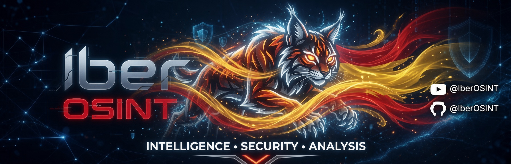
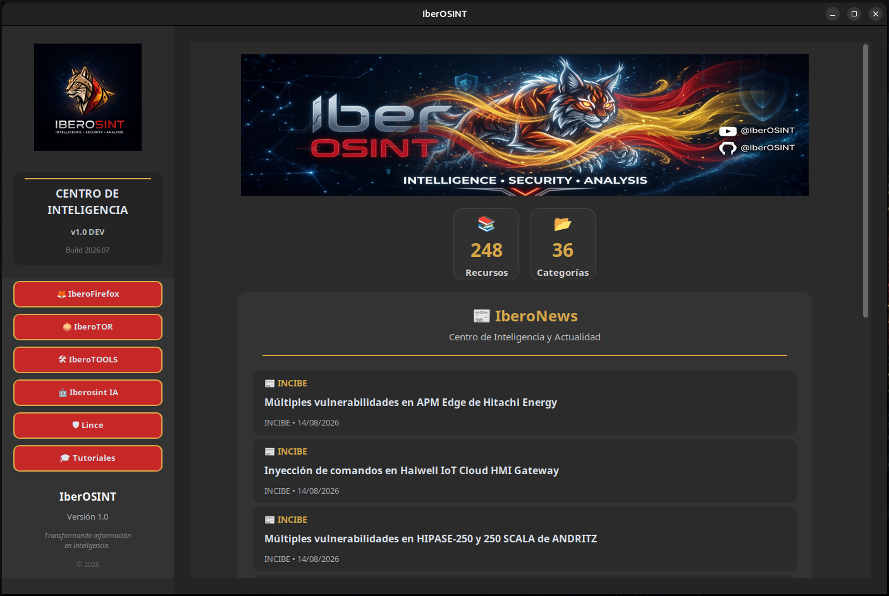
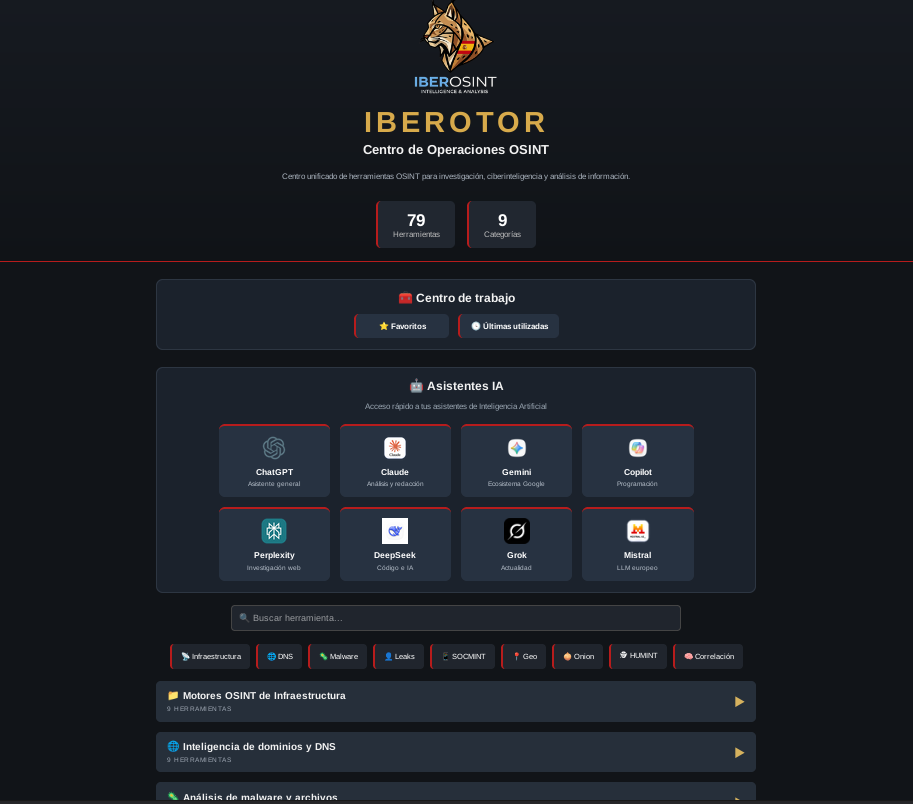
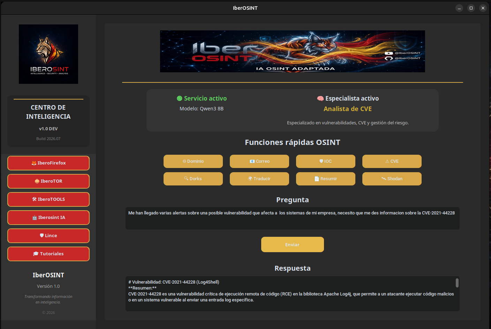
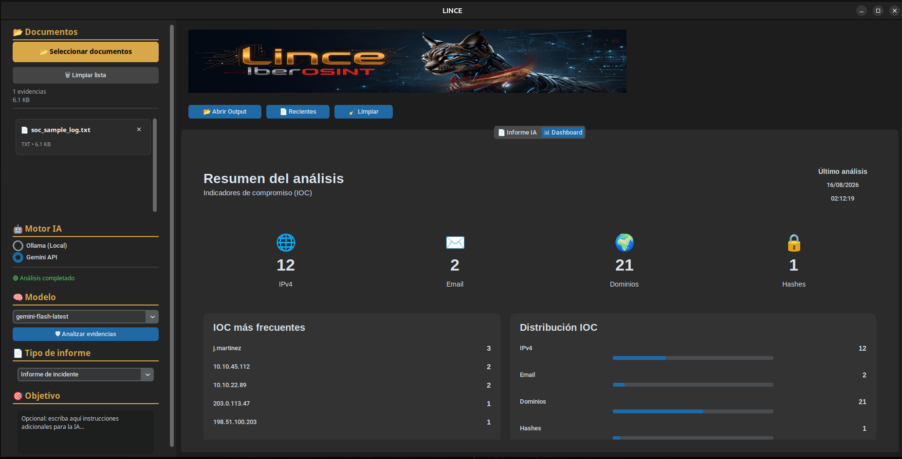
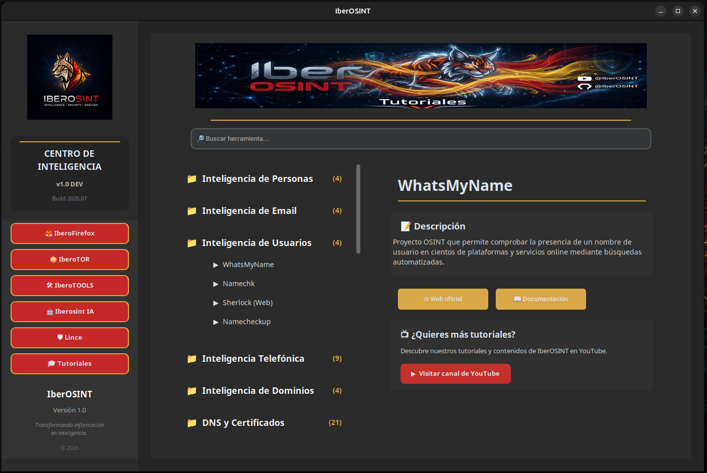

<p align="center">
  
</p>

<h1 align="center">IberOSINT</h1>

<p align="center">
<b>Unified Open Source Intelligence Platform</b><br>
A modular ecosystem for Open Source Intelligence, cybersecurity investigations and AI-assisted analysis.
</p>

<p align="center">

🇪🇸 <b>Español</b> | <a href="README.en.md">🇬🇧 English</a>

</p>

<p align="center">


</p>

---

# ¿Qué es IberOSINT?

**IberOSINT** es una plataforma modular desarrollada para centralizar herramientas de Inteligencia en Fuentes Abiertas (OSINT), automatizar tareas de investigación y facilitar el análisis de información mediante Inteligencia Artificial desde un entorno unificado.

El proyecto integra diferentes aplicaciones especializadas bajo una misma interfaz gráfica, permitiendo al investigador acceder de forma rápida a recursos OSINT, herramientas de análisis, automatizaciones y asistentes basados en IA sin necesidad de utilizar múltiples plataformas independientes.

Lejos de limitarse a ser un recopilatorio de herramientas, IberOSINT propone un ecosistema organizado, escalable y orientado a mejorar el flujo de trabajo durante investigaciones de ciberseguridad, análisis de amenazas y procesos de obtención de inteligencia.

---

# Origen del proyecto

IberOSINT nació como **Trabajo Fin de Máster (TFM)** dentro del **Máster en Ciberseguridad** de la **Universidad Católica de Murcia (UCAM)**.

El objetivo inicial consistía en desarrollar una distribución orientada a la obtención de información en la red que reuniera diferentes herramientas OSINT en un único entorno de trabajo.

Durante el desarrollo, el proyecto evolucionó significativamente hasta convertirse en una plataforma modular compuesta por aplicaciones propias desarrolladas específicamente para facilitar la investigación, la automatización y el análisis asistido mediante Inteligencia Artificial.

Actualmente, IberOSINT continúa evolucionando como un proyecto independiente de investigación y desarrollo.

---

# Filosofía

El diseño de IberOSINT se apoya en cinco principios fundamentales:

- Centralizar el acceso a herramientas OSINT.
- Reducir el tiempo empleado en tareas repetitivas.
- Facilitar el trabajo del analista mediante automatizaciones.
- Integrar Inteligencia Artificial como apoyo al análisis, nunca como sustituto del criterio humano.
- Diseñar una plataforma modular fácilmente ampliable con nuevos componentes.

---

# ¿Por qué IberOSINT?

A diferencia de otros proyectos similares, IberOSINT no pretende ser únicamente una colección de herramientas.

Su objetivo es ofrecer un entorno de trabajo unificado donde cada módulo cumple una función concreta dentro del proceso de investigación.

Entre sus principales características destacan:

- Plataforma modular desarrollada en Python.
- Interfaz gráfica propia.
- Centro OSINT integrado.
- Navegación especializada mediante Firefox y Tor Browser.
- Integración con modelos de Inteligencia Artificial.
- Automatización de procesos.
- Gestión centralizada de herramientas.
- Arquitectura preparada para futuras ampliaciones.
- Experiencia de usuario homogénea entre todos los módulos.

---

# Arquitectura general

El ecosistema IberOSINT está formado por diferentes aplicaciones especializadas que trabajan de forma conjunta bajo un único Launcher.

```

                    IberOSINT
                         │
        ┌────────────────┼────────────────┐
        │                │                │
 IberoFirefox      IberoTOR       IberoTOOLS
        │                │                │
        └────────────────┼────────────────┘
                         │
                  IberOSINT AI
                         │
                       Lince
                         │
                    Tutoriales

```

Cada módulo ha sido desarrollado para cubrir una necesidad específica dentro del flujo de trabajo de un analista OSINT, manteniendo una arquitectura modular que facilita su mantenimiento y evolución.

---

# El Ecosistema IberOSINT

IberOSINT está formado por un conjunto de aplicaciones desarrolladas para cubrir las distintas fases de una investigación OSINT.

Cada módulo resuelve un problema específico, pero todos comparten una misma filosofía de diseño, una interfaz homogénea y una integración transparente dentro del Launcher principal.

---

# Launcher

El Launcher constituye el punto de entrada del ecosistema IberOSINT.

Desde una única interfaz gráfica es posible acceder a todos los módulos disponibles, iniciar aplicaciones, organizar el espacio de trabajo y centralizar las diferentes utilidades que forman parte de la plataforma.

Su diseño busca reducir la complejidad del entorno de trabajo y ofrecer una experiencia uniforme independientemente del módulo utilizado.

### Características principales

- Interfaz gráfica desarrollada en Python.
- Acceso unificado a todos los módulos.
- Diseño modular y escalable.
- Organización intuitiva de herramientas.
- Integración con aplicaciones externas.

<p align="center">

</p>

*Pantalla principal del Launcher de IberOSINT.*

---

# IberoFirefox

IberoFirefox es un centro de inteligencia OSINT construido sobre Firefox que reúne cientos de recursos clasificados por categorías.

Su objetivo es eliminar el tiempo invertido buscando herramientas en Internet y ofrecer un punto de acceso centralizado para investigaciones de ciberseguridad, análisis de amenazas, reconocimiento e inteligencia.

La página principal ha sido desarrollada completamente en HTML, CSS y JavaScript, funcionando de forma local sin depender de servicios externos.

### Características principales

- Homepage OSINT personalizada.
- Recursos organizados por categorías.
- Buscador integrado.
- Gestión de favoritos.
- Historial de herramientas utilizadas.
- Diseño optimizado para investigación.
- Funcionamiento completamente offline.

<p align="center">

</p>

*Centro OSINT integrado en Firefox.*

---

# IberoTOR

IberoTOR adapta el concepto de IberoFirefox al entorno de Tor Browser, proporcionando un espacio de trabajo orientado a investigaciones donde el anonimato resulta un requisito esencial.

La plataforma mantiene la misma filosofía de organización que el resto del ecosistema, ofreciendo acceso rápido a recursos especializados accesibles mediante Tor Browser.

### Características principales

- Integración con Tor Browser.
- Homepage optimizada para navegación anónima.
- Acceso centralizado a recursos OSINT.
- Organización por categorías.
- Interfaz homogénea con el resto del ecosistema.

<p align="center">

</p>

*Entorno de trabajo OSINT para Tor Browser.*

---

# IberoTOOLS

IberoTOOLS centraliza las herramientas instaladas dentro de la distribución, permitiendo acceder a ellas desde una única interfaz sin necesidad de recordar comandos o ubicaciones.

Su finalidad es simplificar la utilización de utilidades relacionadas con reconocimiento, análisis, enumeración y otras tareas habituales durante investigaciones de ciberseguridad.

La arquitectura está preparada para incorporar nuevas herramientas conforme evolucione el proyecto.

### Características principales

- Gestión centralizada de herramientas.
- Acceso rápido desde la interfaz gráfica.
- Arquitectura fácilmente ampliable.
- Organización por categorías.
- Integración con el Launcher.

<p align="center">

</p>

*Gestión unificada de herramientas del ecosistema.*

---

# IberOSINT AI

IberOSINT AI incorpora capacidades de Inteligencia Artificial dentro del ecosistema para asistir al analista durante diferentes fases de una investigación.

Su objetivo no consiste en sustituir el análisis humano, sino en proporcionar apoyo durante tareas como la interpretación de información, generación de resúmenes, clasificación de evidencias o automatización de procesos repetitivos.

La arquitectura permite integrar diferentes proveedores de IA manteniendo una experiencia homogénea para el usuario.

### Características principales

- Integración de múltiples modelos de IA.
- Asistencia al análisis.
- Automatización de tareas.
- Arquitectura preparada para futuras integraciones.
- Diseño modular.

<p align="center">

</p>

*Servicios de Inteligencia Artificial integrados en la plataforma.*

---

# Lince

Lince constituye el módulo de análisis documental del ecosistema IberOSINT.

Permite procesar evidencias, realizar análisis asistidos mediante Inteligencia Artificial, extraer indicadores de compromiso (IOC), generar informes estructurados y facilitar el trabajo del analista durante investigaciones de ciberseguridad.

Su desarrollo se ha centrado en ofrecer una interfaz intuitiva que combine automatización y control por parte del investigador.

### Características principales

- Análisis documental asistido mediante IA.
- Procesamiento de múltiples evidencias.
- Extracción automática de IOC.
- Exportación de informes.
- Dashboard de indicadores.
- Integración con distintos proveedores de IA.

<p align="center">

</p>

*Lince, plataforma de análisis documental integrada en IberOSINT.*

---

# Tutoriales

El módulo de Tutoriales reúne documentación práctica destinada a facilitar el aprendizaje y la utilización del ecosistema.

Su finalidad es ofrecer una referencia organizada para que tanto nuevos usuarios como investigadores experimentados puedan aprovechar todas las capacidades de la plataforma.

Los contenidos se encuentran organizados de forma progresiva y orientados a un uso práctico.

### Características principales

- Guías paso a paso.
- Documentación técnica.
- Buenas prácticas.
- Recursos de aprendizaje.
- Actualización continua.

<p align="center">

</p>

*Centro de documentación y aprendizaje del ecosistema.*

---

# Tecnologías utilizadas

IberOSINT combina diferentes tecnologías de desarrollo con el objetivo de ofrecer una plataforma modular, ligera y fácilmente ampliable.

| Tecnología | Función |
|------------|---------|
| Python | Desarrollo del Launcher y módulos principales |
| CustomTkinter | Interfaz gráfica de escritorio |
| HTML5 | Desarrollo de las homepages OSINT |
| CSS3 | Diseño de la interfaz web |
| JavaScript | Funcionalidades dinámicas de las homepages |
| Bash | Automatización de procesos |
| Ubuntu Linux | Sistema operativo base |
| Firefox | Centro OSINT principal |
| Tor Browser | Navegación anónima |
| Ollama | Ejecución local de modelos de IA |
| Google Gemini | Inteligencia Artificial en la nube |

---

# Requisitos

Para ejecutar IberOSINT se recomienda el siguiente entorno:

- Ubuntu 24.04 LTS o superior.
- Python 3.11 o superior.
- Firefox.
- Tor Browser.
- Conexión a Internet para acceder a recursos OSINT.
- Ollama instalado para utilizar modelos locales (opcional).
- Clave API de Google Gemini para funciones de IA en la nube (opcional).

---

# Instalación

Clonar el repositorio:

```bash
git clone https://github.com/JSantos1990/IberOSINT.git
```

Acceder al directorio del proyecto:

```bash
cd IberOSINT
```

Ejecutar la aplicación:

```bash
python app.py
```

> **Nota:** Algunas funcionalidades requieren herramientas externas previamente instaladas o configuradas.

---

# Estado del proyecto

IberOSINT continúa evolucionando de forma activa.

La arquitectura modular del proyecto facilita la incorporación de nuevas herramientas, servicios y funcionalidades sin afectar al resto del ecosistema.

Actualmente el proyecto integra múltiples aplicaciones desarrolladas específicamente para centralizar investigaciones OSINT y análisis asistidos mediante Inteligencia Artificial.

---

# Roadmap

## Versión 1.0

- [x] Launcher gráfico
- [x] Arquitectura modular
- [x] IberoFirefox
- [x] IberoTOR
- [x] IberoTOOLS
- [x] Integración de Inteligencia Artificial
- [x] Lince
- [x] Sistema de tutoriales

## Próximas mejoras

- [ ] Marketplace de herramientas
- [ ] Sistema de plugins
- [ ] Actualizador integrado
- [ ] Nuevos módulos OSINT
- [ ] Integración de nuevos proveedores de IA

---

# Capturas

## Launcher


---

## IberoFirefox


---

## IberoTOR


---

## IberoTOOLS


---

## Lince


---

# Licencia

Copyright © 2026 Jou Santos Aveiro.

Todos los derechos reservados.

Este proyecto fue desarrollado originalmente como Trabajo Fin de Máster en Ciberseguridad y posteriormente evolucionó como un proyecto independiente de investigación y desarrollo.

El código fuente, la documentación, las imágenes y el resto de los recursos incluidos en este repositorio son propiedad intelectual del autor.

No está permitida la copia, redistribución, modificación o utilización parcial o total del proyecto sin autorización expresa y por escrito del autor.

Para más información consulte el archivo **LICENSE** incluido en este repositorio.

---

# Autor

## Jorge Santos

Desarrollador de IberOSINT.

Proyecto iniciado como Trabajo Fin de Máster en Ciberseguridad (UCAM) y evolucionado posteriormente como una plataforma independiente orientada a la investigación OSINT, la automatización de procesos y el análisis asistido mediante Inteligencia Artificial.

GitHub:

https://github.com/JSantos1990

---

# Agradecimientos

Mi agradecimiento a todas las comunidades y proyectos Open Source que, mediante sus herramientas y documentación, contribuyen al avance de la investigación en ciberseguridad y Open Source Intelligence.

---

<p align="center">

<strong>IberOSINT</strong><br>

Unified Open Source Intelligence Platform

<br><br>

© 2026 Jorge Santos · All Rights Reserved

</p>
